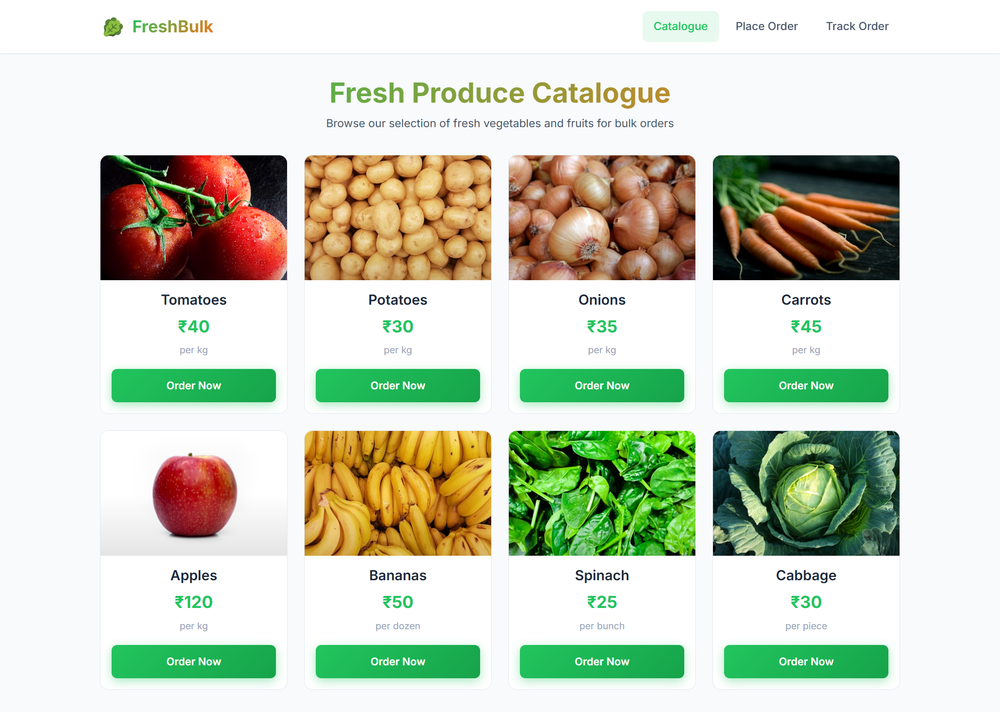
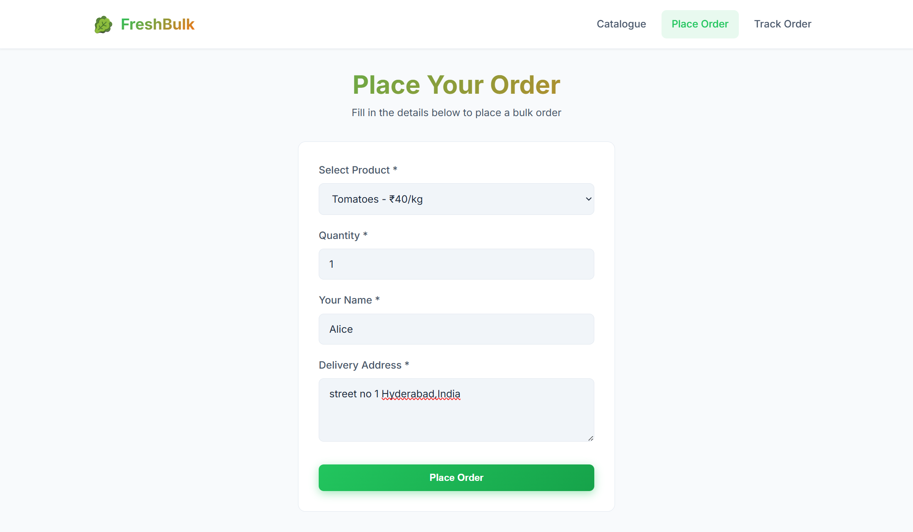
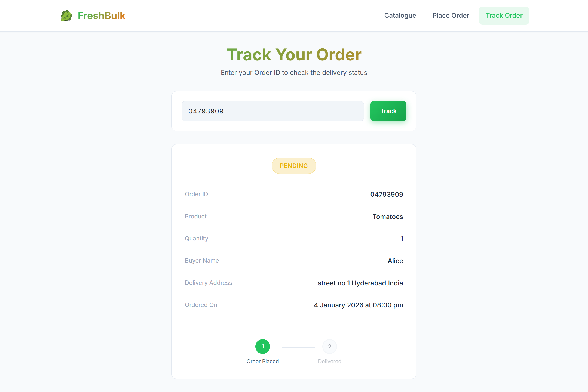
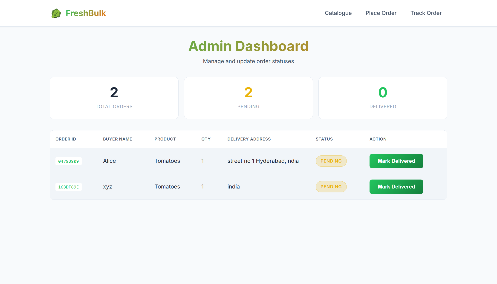
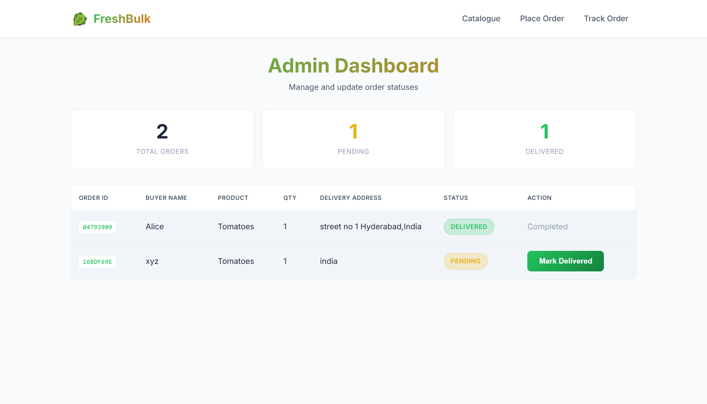

# FreshBulk - Bulk Vegetable & Fruit Ordering Platform

A full-stack web application for bulk ordering of vegetables and fruits. Built with React.js frontend and Node.js/Express backend with MongoDB database.

## Features

- 🥬 **Product Catalogue** - Browse available vegetables and fruits with images and prices
- 📝 **Place Orders** - Easy ordering system with quantity selection
- 🔍 **Track Orders** - Check order status using order ID
- 👨‍💼 **Admin Panel** - View all orders and update delivery status

## Tech Stack

**Frontend:**
- React.js 18
- React Router DOM
- Vite
- CSS3

**Backend:**
- Node.js
- Express.js
- MongoDB (Mongoose)
- UUID for order IDs

## Screenshots

### Product Catalogue
Browse fresh vegetables and fruits with real-time pricing.



### Place Order
Easy ordering system with product selection and delivery details.



### Order Confirmation
Get your unique order ID after placing an order.


### Track Order
Track your order status using your unique order ID.



### Admin Dashboard
View and manage all orders with status updates.



### Admin - Order Delivered
Mark orders as delivered with one click.



## Project Structure

```
Vegetables/
├── backend/
│   ├── routes/
│   │   ├── admin.js
│   │   ├── orders.js
│   │   └── products.js
│   ├── database.js
│   ├── server.js
│   └── package.json
├── frontend/
│   ├── src/
│   │   ├── components/
│   │   ├── pages/
│   │   ├── App.jsx
│   │   └── main.jsx
│   ├── package.json
│   └── vite.config.js
└── README.md
```

## Getting Started

### Prerequisites

- Node.js (v18 or higher)
- MongoDB Atlas account or local MongoDB installation
- npm or yarn

### Installation

1. **Clone the repository**
   ```bash
   git clone https://github.com/kaushikdontha/Bulk-Vegetables.git
   cd Bulk-Vegetables
   ```

2. **Setup Backend**
   ```bash
   cd backend
   npm install
   ```

3. **Setup Frontend**
   ```bash
   cd frontend
   npm install
   ```

### Running the Application

1. **Start the Backend** (from `backend/` folder)
   ```bash
   npm run dev
   ```
   Server runs on http://localhost:5000

2. **Start the Frontend** (from `frontend/` folder)
   ```bash
   npm run dev
   ```
   App runs on http://localhost:5173

## API Endpoints

| Method | Endpoint | Description |
|--------|----------|-------------|
| GET | `/api/products` | Fetch all products |
| POST | `/api/orders` | Place a new order |
| GET | `/api/orders/:id` | Get order status |
| GET | `/api/admin/orders` | Get all orders (admin) |
| PUT | `/api/admin/orders/:id` | Update order status |
| GET | `/api/health` | Health check |

## Environment Variables

Create a `.env` file in the `backend/` folder:

```env
MONGODB_URI=your_mongodb_connection_string
PORT=5000
```

## Live Demo

- **Frontend**: https://bulk-vegetables.vercel.app
- **Backend API**: Hosted on Render
